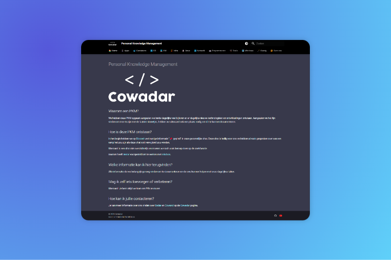

# Cowadar Personal Knowledge Management

<p align="center">
  <a href="https://github.com/cowadar/pkm">
    
  </a>

  <h3 align="center">Cowadar</h3>

  <p align="center">
    Personal Knowledge Management
    <br/>
    <br/>
    <a href="https://github.com/cowadar/pkm/issues">Fout melden</a>
    .
    <a href="https://github.com/cowadar/pkm/issues">Feature aanvragen</a>
  </p>
</p>

   

## Inhoudsopgave

- [Cowadar Personal Knowledge Management](#cowadar-personal-knowledge-management)
  - [Inhoudsopgave](#inhoudsopgave)
  - [Over Cowadar](#over-cowadar)
  - [Gemaakt met](#gemaakt-met)
  - [Aan de slag](#aan-de-slag)
    - [Vereisten](#vereisten)
    - [Installatie](#installatie)
  - [Gebruik](#gebruik)
  - [Roadmap](#roadmap)
  - [Contributing](#contributing)
    - [Creating A Pull Request](#creating-a-pull-request)
  - [License](#license)
  - [Authors](#authors)

## Over Cowadar



We hebben deze PKM opgezet aangezien we beide dagelijks veel bijleren en er dagelijks nieuwe technologiëen en ontwikkelingen ontstaan. Aangezien we het fijn vinden om mee te zijn met de laatste nieuwtjes, hebben we uiteraard ook een plaats nodig om dit te kunnen documenteren.

Hoe is deze PKM ontstaan?
In het begin hebben we op Discord veel nuttige informatie "📌 gepind" in onze gezamelijke chat. Deze chat is heilig voor ons en hebben al vaak gesproken over wat een ramp het zou zijn als deze chat ooit verwijderd zou worden.

Uiteraard is een chat niet overzichtelijk en moeten we toch vaak beroep doen op de zoekfunctie.

Daarom heeft Bedar voorgesteld om te werken met mkdocs.

## Gemaakt met

* ♥️
* [Material for MkDocs](https://squidfunk.github.io/mkdocs-material/)

## Aan de slag

Onze website bestaat uit 2 repositories:

- cowadar/cowadar
- cowadar/pkm

Volg deze eenvoudige stappen om een lokale kopie aan de gang te krijgen.


### Vereisten

Zorg voor je begint dat je deze packages hebt geinstalleerd:

* git
```sh
sudo apt install git
```

* python
```sh
sudo apt install -y python3-pip
```

### Installatie

1. Clone de repo

```sh
git clone https://github.com/cowadar/pkm.git
```
2. Navigeer naar de folder

```sh
cd cowadar
```

3. Installeer de repo requirements

```sh
pip install -r requirements
```

## Gebruik

MkDocs bevat een live preview-server, zodat u uw wijzigingen kunt bekijken terwijl u uw documentatie schrijft. De server zal de site na het opslaan automatisch opnieuw opbouwen. Begin het met:

```sh
mkdocs serve
```

Om de projectdocumentatie handmatig te implementeren, kunt u gewoon de volgende opdracht gebruiken vanuit de map met het bestand `mkdocs.yml`:

```sh
mkdocs gh-deploy --force
```

## Roadmap

Zie de [open issues](https://github.com/cowadar/pkm/issues) voor een lijst met voorgestelde features (en gekende issues).

## Contributing

Bijdragen maken de open source-community zo'n geweldige plek om te leren, te inspireren en te creëren. Elke bijdrage die u levert wordt ***zeer op prijs gesteld***.

- Als je suggesties hebt voor het toevoegen of verwijderen van projecten, open dan gerust een probleem om het te bespreken, of maak direct een pull-aanvraag nadat je het *README.md*-bestand met de nodige wijzigingen hebt bewerkt.
- Zorg ervoor dat je je spelling en grammatica controleert.
- Creëer individuele PR voor elke suggestie.

### Creating A Pull Request

1. Fork the Project
2. Creëer je Feature Branch (`git checkout -b feature/AmazingFeature`)
3. Commit je aanpassingen (`git commit -m 'Add some AmazingFeature'`)
4. Push naar de Branch (`git push origin feature/AmazingFeature`)
5. Open een Pull Request

## License

Distributed under the MIT License. See [LICENSE](https://github.com/cowadar/pkm/blob/main/LICENSE.md) for more information.

## Authors

* **Bedar** - *Homelab freak* - [Bedar](https://github.com/bedar89/) - *Repo & website maintainer*
* **Cowarol** - *Netwerk zot* - [Cowarol](https://github.com/cowarol/) - *Schrijver*
