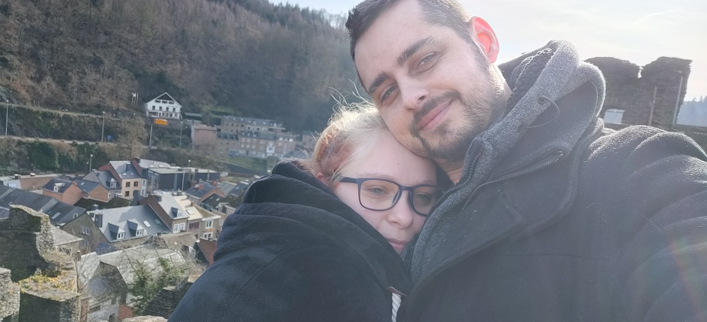

# Bedar

## Over mij

Ik ben sinds kinds af aan gepassioneerd door computers, servers, networking en basically alles dat met IT te maken heeft.

Mijn eerste herinnering was toen ik als kind een joystick gekregen had voor mijn verjaardag. Uiteraard bestond er toen nog geen "plug & play" en was mijn vader bezig om de drivers werkende te krijgen voor mij. Zo zat ik uren naast hem te kijken hoe hij al de magische getallen en cijfers deed veranderen (ja, het was in de het [MS-DOS](../windows/msdos.md) tijdperk). Tijdens dat hij hiermee bezig was, heb ik hem verschillende vragen gesteld en leerde ik dus op vroege leeftijd al hoe je een computer moest aansluiten. (Dit was als kind al veel)

Door deze herinnering is er een vurige passie ontstaan om met IT te werken. Of zoals mijn moeder zegt "Zolang het maar iets met computers is".

Op school bestond er eerst nog een informatica richting en ben dus maar Electro mechanica gaan studeren, in de hoop om later robots te kunnen aansturen.
Echter kregen we opeens het nieuws dat er eindelijk een Informatica richting beschikbaar zou zijn in het 5de middelbaar.
Deze kans heb ik niet laten liggen en heb in het 4de middelbaar mijn grootste inspanning gedaan om naar Informatie te kunnen overschakelen.

## Carriere

Door omstandigheden, ben ik eerder met school gestopt en ben ik moeten gaan werken. In het begin waren dit magazijnier-achtige jobs, maar heb opeens de kans gekregen om in een cold-calling bedrijf terecht te komen die IT oplossingen "verkocht" aan andere bedrijven. Hier haalde ik zeer goede resultaten, aangezien ik op hetzelfde niveau als een IT Manager kon spreken, wat mijn success-rate naar boven heeft gehaald.

Toch wou ik naar iets anders op zoek, aangezien ik niet alle dagen wou uitbellen en ben dan uiteindelijk in de IT Distributie terecht gekomen.
Dit was origineel niet mijn "eindstation", maar de combinatie met Sales en IT begon ik steeds fijner te vinden. Zo kan ik tegelijkertijd mensen helpen, met gelijkzinnige mensen over IT onderwerpen praten en mijn IT kennis blijven bijschaven.

Momenteel ben ik werkzaam bij 1 van de grootste IT Distributeurs in de wereld als "Technical Presales Specialist".

Het voelt nog niet alsof ik op mijn eindstation zit, maar wegens het aanschaffen van een huis, blijf ik wel graag even in dit station zitten :wink:

## Waar kan je mij vinden?

