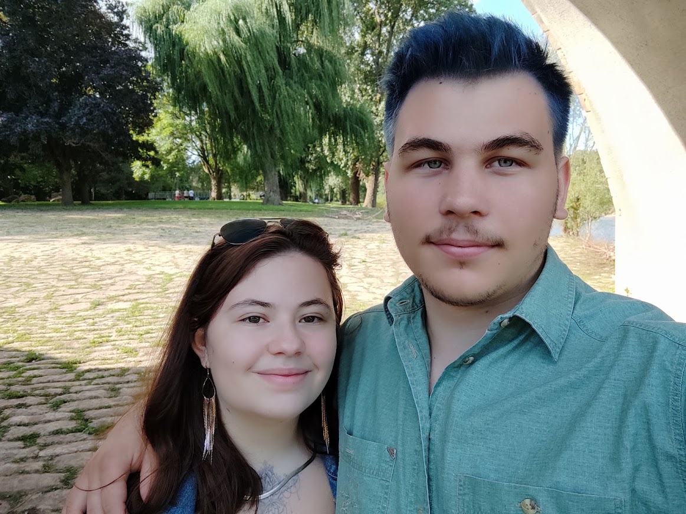

# Cowarol

## Over mij

Op 14 jarige leeftijd was ik reeds op eigen initiatief de router van mijn ouders aan het
configureren. Later breidde ik dit zelf verder uit met meerdere routers en switchen tot een
groter thuisnetwerk en dit zonder enige scholing op dat moment. Zo groeide mijn interesse inIT
verder. Op dat momment was ik nog in mijn opleidign Elektricitet.
Na deze opeleiding heb ik toch de stap gewaacht om verder te sturderen en ben ik mijn opleiding Systeem & netwerkeheer gestart.
Na mijn 2 jarige opleiding ben ik gestart als Netwerk beheerder. En omdat ik er geen genoeg van keeg ben ik nu een systeem en netwerkbeheerder.

Naast mijn enorme intresse in IT ga ik ook nog muurklimmen. Dat brengt me helemaal tot rust.