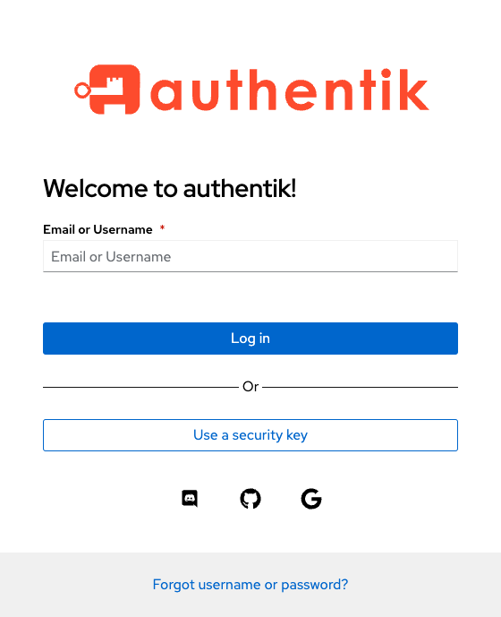

# Authentik

## Bypass MFA on Local Network

In this video, I demonstrate how to setup an expression policy to check if a client's IP address is local and if so, bypass 2-factor-authentication/multi-factor-authentication.

## Password Recovery Flow Setup

In this video I show how to create a flow in Authentik to allow users to reset their passwords via email.
