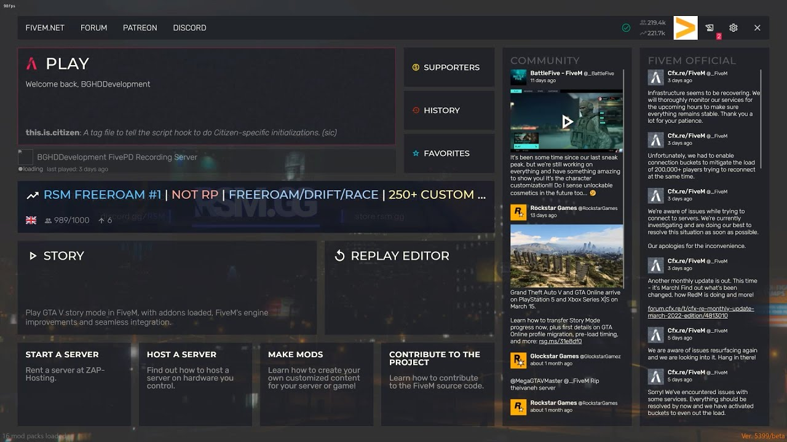

# Fivem

Fivem is een modificatie voor [Grand Theft Auto V](../windows/games/gta5.md) waarmee je multiplayer kunt spelen op aangepaste servers, aangedreven door Cfx.re. Fivem maakt gebruik van de fxOM script runtimes, die verschillende programmeertalen ondersteunen, zoals Lua, C# en JavaScript. Fivem laat je toe om je eigen server te maken of deelnemen aan bestaande servers met verschillende spelmodi, zoals roleplay, racen, deathmatch en meer. Fivem heeft ook een uitgebreide documentatie voor ontwikkelaars die meer willen weten over de kernmechanismen van de modificatie.



## Installatie
Om Fivem te gebruiken, moet je het downloaden van de website en installeren op je computer . Je hebt ook een geïnstalleerde en bijgewerkte versie van GTA V nodig. Fivem verandert niets aan je GTA V installatie, dus je kunt zonder problemen wisselen tussen Fivem en [GTA:O](../windows/games/gta5.md#gta-online). Fivem heeft geen invloed op de [Rockstar](../windows/games/gta5.md#rockstar) Online Services, dus je kunt niet geband worden voor het spelen van Fivem.

### Systeem vereisten
De systeemeisen voor Fivem zijn afhankelijk van de server waarop je speelt, maar over het algemeen zijn ze vergelijkbaar met die van GTA V.

#### Windows
Voor Windows heb je minimaal nodig:
- Intel Core 2 Q6600 @ 2.40GHz / AMD Phenom 9850 @ 2.5GHz CPU
- NVIDIA 9800 GT 1GB / AMD HD 4870 1GB / Intel HD GT2 GPU
- 8GB RAM
- 72GB + ~4GB HDD

#### Linux
Voor Linux heb je minimaal nodig:
- Intel Core i3-3220 @ 3.30GHz / AMD FX-6300 @ 3.5GHz CPU
- NVIDIA GeForce GT 710 / AMD Radeon HD 6450 GPU
- 8GB RAM
- 72GB + ~4GB HDD

## Fivem self-hosting

Om Fivem uit te rollen met [Docker](../container/docker/docker.md), moet je eerst [Docker](../container/docker/docker.md#installation) installeren op je Linux machine. Daarna kun je de volgende stappen volgen:

1. Maak een map aan voor je serverbestanden, bijvoorbeeld `~/fivem`.
2. Download het `server-data` repository van GitHub naar je map:
    ```sh
    git clone https://github.com/citizenfx/cfx-server-data.git ~/fivem/server-data
    ```
3. Download het `server` bestand van de Fivem website naar je map:

    ```bash
    wget https://runtime.fivem.net/artifacts/fivem/build_proot_linux/master/439-xxxxxxxxxxxxxxxxxxxxxxxxxxxxxxxxxxxxxxxx/server -O ~/fivem/server
    ```

    ??? note "Laatste versie terugvinden"
        Via [https://runtime.fivem.net/artifacts/fivem/build_proot_linux/master/](https://runtime.fivem.net/artifacts/fivem/build_proot_linux/master/) kan je de laatste versie terugvinden.

4. Maak het `server` bestand uitvoerbaar:

    ```bash
    chmod +x ~/fivem/server
    ```

5. Maak een `Dockerfile` aan in je map met de volgende inhoud:

    ```dockerfile
    FROM debian:stable-slim
    RUN apt-get update && apt-get install -y curl xz-utils
    WORKDIR /opt/fivem
    COPY server .
    COPY server-data ./server-data
    EXPOSE 30120/tcp
    EXPOSE 30120/udp
    CMD ["/opt/fivem/server", "+exec", "server.cfg"]
    ```

6. Bouw de Docker image met het commando:

    ```bash
    docker build -t fivem-server ~/fivem
    ```

7. Start de Docker container met het commando:
    ```bassh
    docker run -d --name fivem-server -p 30120:30120/tcp -p 30120:30120/udp fivem-server
    ```

8. Je kunt nu verbinding maken met je Fivem server via het `IP-adres` en de poort van je Linux machine.


## Download laatste fivem artifacts

```bash
wget https://runtime.fivem.net/artifacts/fivem/build_proot_linux/master/5878-a5c270439ddb3bbb1fc4e7d02cb5593be84a9b89/fx.tar.xz && tar -xf fx.tar.xz --strip-components=1 --exclude alpine/dev --exclude alpine/proc --exclude alpine/run --exclude alpine/sys && rm fx.tar.xz
```
