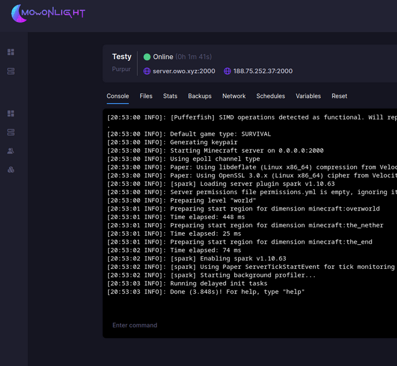

# Moonlight



Moonlight Panel is een gratis en open-source hostingpaneel dat is ontworpen om het beheer van game- en webservers te vereenvoudigen. Het biedt een snelle en responsieve gebruikersinterface, ondersteund door een efficiënte backend, waardoor gebruikers meer controle hebben over de gehoste diensten.
Moonlight Panel

Belangrijke kenmerken van Moonlight Panel zijn:

- **Plugin- en functiesysteem**: Maakt het mogelijk om het paneel aan te passen en workflows te optimaliseren.
- **Virtuele schijven**: Beschermt tegen exploits die proberen de harde schijf van de server te beschadigen.
- **Privénetwerken**: Isoleert subservers en kritieke API's zonder complexe firewallconfiguraties.
- **Rechtenbeheer**: Biedt gedetailleerde controle over de acties die beheerders kunnen uitvoeren.
- **Diagnosesysteem**: Helpt bij het snel identificeren en oplossen van problemen.

  [Moonlight Panel](https://moonlightpanel.xyz)

Moonlight Panel is volledig on-premise, wat betekent dat alle gegevens en diensten binnen uw eigen infrastructuur blijven. Het project is oorspronkelijk ontwikkeld voor Endelon Hosting en is nu een onafhankelijk project met als doel een alles-in-één oplossing te bieden voor hostingbedrijven en gemeenschappen.

!!! info
    Dit is een heel goed alternatief voor [Pterodactyl](pterodactyl.md). En ja kan de Pterodactyl Eggs hier ook gebruiken.

## Installatie
### Requirements
- An Ubuntu Linux server
- The ability to run Docker
- 4 GB of memory (recommended; can work with less)
- 20GB of disk space
- 2 Cores

## Installeren
### Panel
In de huidge release hebben ze nog geen Docker compose file.
voer het volgde uit:
```bash
bash <(curl https://get-moonlight.app)
```
Als het bovenstaande niet werkt:
```bash
curl -o moonlight-installer.sh https://get-moonlight.app
chmod +x moonlight-installer.sh
sudo ./moonlight-installer.sh
```
Tijdens de installatie sellecteer je:
Moonlight Panel --> Install

En volg de standaard instellingen

Als ales doorlopen is voer je het volgende uit:
```bash
mlcli moonlight login
```

!!! note
    Alls je de login niet ziet doe je:
    ```bash
    mlcli moonlight logs
    ```

Nu kan je via het "ip+port" aan de webinterface en aanmelden.

### Node
Open het admin panel en ga naar Servers => Nodes.
Maak nu een node aan. Als je node hebt aangemaakt bewerk je de node en ga je naar "setup".
Nu kopieer het commando en plak je dit op dezelfde of de desbetreffende server.
En volg de stappen die gevraagd worden.

## Configuratie
### Allocations
Maak nu zoals bij Pterodactyl allocations aan onder Server --> nodes --> node --> allocations
!!! note
    Ja mag het ip op 0.0.0.0 zetten en de juiste poort(en).

### Images/ Eggs
Deze Importeer je alle 2 onder servers --> images.

!!! warning
    Vergeet voor of na het importeren van de Images/Eggs zeker niet de juiste poort Allocations te doen.

**Image**

Een image is een vooraf geconfigureerde besturingssysteemomgeving die als basis dient voor een server. Dit kan een Docker-image of een VM-image zijn. In hostingpanels wordt vaak Docker gebruikt, en een Docker-image bevat alles wat nodig is om een applicatie uit te voeren, zoals het besturingssysteem, bibliotheken en afhankelijkheden.

Voorbeeld: Een Minecraft-server image kan een vooraf geconfigureerde versie van een Minecraft-server bevatten, zodat deze snel en consistent kan worden gedraaid binnen een container.

**Egg**

Een egg is een configuratiebestand of sjabloon dat wordt gebruikt binnen hostingpanels zoals Pterodactyl en Moonlight Panel om servers in te stellen. Een egg bevat instructies zoals:

- Welke Docker-image moet worden gebruikt
- Welke opstartparameters en milieuvariabelen nodig zijn
- Welke poorttoewijzingen vereist zijn
- Welke bestanden en mappen worden gebruikt

Voorbeeld: Een Minecraft Egg bepaalt welke versie van Minecraft wordt geïnstalleerd, welke poorten worden geopend, en welke startup-opdrachten worden uitgevoerd.
**Samengevat**

- **Image**: De complete serveromgeving (bijv. een Docker-image met het OS en basissoftware).
- **Egg**: Een configuratiebestand dat bepaalt hoe een server wordt ingesteld en beheerd binnen een hostingpanel.

#### Images 
Deze kan kan je terug vinden in hun [Discord server](https://discord.gg/AUZjsgbv)

#### Eggs 
De bestaande Pterodactyl [Eggs](https://github.com/pelican-eggs/eggs/tree/master/game_eggs) die je kan vinden.


!!! warning
    Het kan zijn dat niet alle Eggs compatieble zijn.


## Review
Na het uitgebreid testen van deze service. Raad ik deze aan alle mensen aan die een hosting service thuis willen draaien.
Je hebt alle vrijheid en een makkelijke setup. In de volgende release komt ook een Docker Compose voor nog meer vrijheid.
De support is ook snel en goed.