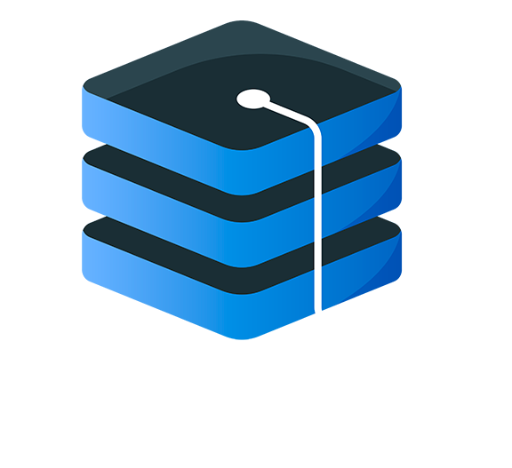

# Personal Knowledge Management

## Waarom een PKM?

We hebben deze PKM opgezet aangezien we beide dagelijks veel bijleren en er dagelijks nieuwe technologiëen en ontwikkelingen ontstaan.
Aangezien we het fijn vinden om mee te zijn met de laatste nieuwtjes, hebben we uiteraard ook een plaats nodig om dit te kunnen documenteren.

## Hoe is deze PKM ontstaan?

In het begin hebben we op [Discord](apps/discord.md) veel nuttige informatie "📌 gepind" in onze gezamelijke chat. Deze chat is heilig voor ons en hebben al vaak gesproken over wat een ramp het zou zijn als deze chat ooit verwijderd zou worden.

Uiteraard is een chat niet overzichtelijk en moeten we toch vaak beroep doen op de zoekfunctie.

Daarom heeft [Bedar](about/bedar.md) voorgesteld om te werken met [mkdocs](apps/mkdocs.md).

## Welke informatie kan ik hier terugvinden?

Alle informatie die we belangrijk genoeg vinden om te documenteren en die ons kunnen helpen met onze dagelijkse taken.

## Mag ik zelf iets toevoegen of verbeteren?

Uiteraard! Je bent altijd welkom om PR's te sturen.

## Hoe kan ik jullie contacteren?

Je kan meer informatie over ons vinden over [Bedar](about/bedar.md) en [Cowarol](about/cowarol.md) op de [Cowadar](about/cowadar.md) pagina.
