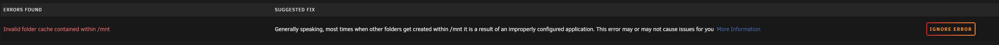

# Unraid

## Errors

| Error message | Screenshot | Error description | Solution |
|---|---|---|---|
| Invalid folder cache contained within /mnt | | Generally speaking, most times when other folders get created within /mnt it is a result of an improperly configured application. This error may or may not cause issues for you  [More Information](https://forums.unraid.net/topic/120220-fix-common-problems-more-information/?tab=comments#comment-1098777)| ?
