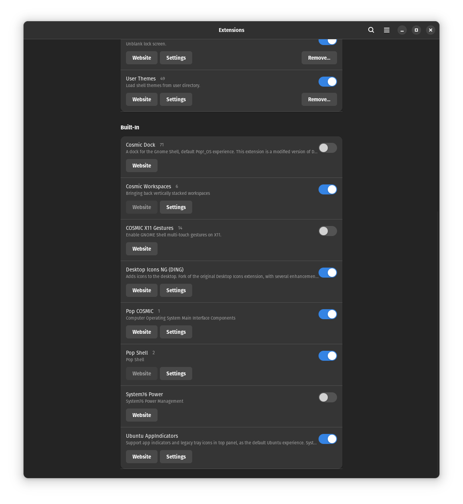

## Gnome

[Pop!\_OS](./popos.md) gebruikt [Gnome](../../gnome.md) als window manager.

## Gnome extensions

1. Ga naar [https://extensions.gnome.org/](https://extensions.gnome.org/)
2. Download en installeer de Browser Extension in je browser (zie link bovenaan de pagina)
   !!! note
   The extension allows GNOME to look in the user directory for themes and icons
3. Click op `User Themes` en activeer deze.

## Folder creatie

Voor je van start kunt, moet je eerst 2 folders aanmaken.

1. Ga naar je home directory.
2. Maak de folders `.themes` en `.icons`.

## Dracula Theme

1. Ga naar [https://draculatheme.com](https://draculatheme.com).
2. Vul `gtk` in de zoekbalk
3. Download het zip bestand van Github
4. Drag-and-drop de folder in de zip file naar `~/.themes`
5. Hernoem de folder naar `Dracula`

## Gnome Tweaks

### Installatie gnome-tweaks

Installeer `gnome-tweaks` met `sudo apt install gnome-tweaks`

### Aanpassingen

Open `gnome-tweaks` en ga naar de `Appearance` tab en verander het volgende:

- Applications: `Dracula`
- Shell: `Dracula`

!!! danger
Er zullen vermoedelijk al enkele zaken aangepast zijn, maar om zeker te zijn, is het best om _uit te loggen_ en _terug in te loggen_.

## Icon pack & Cursor

### Icon pack

1. Ga naar [https://www.gnome-look.org](https://www.gnome-look.org)
2. Zoek naar `Flatery`
   
3. Download de `indigo` versie.

### Cursor

1. Ga naar [https://www.gnome-look.org](https://www.gnome-look.org)
2. Zoek naar `McMojave cursors`
   
3. Download

### Installatie flatery & McMojave

1. Sleep de `flatery` & `McMojave` folders in de zip file naar `~/.icons`
2. Open `gnome-tweaks` opnieuw
3. Ga naar de `Appearance` tab
4. Verander volgende zaken
   - Icons: `Flatery-Indigo`
   - Cursor: `McMojave-cursors`

## Andere theme voor de Shell

1. Ga naar [https://www.gnome-look.org](https://www.gnome-look.org)
2. Zoek naar `Sweet - New Flavor`.
   
3. Download `Sweet-Dark-v40.tar.xz`
4. Sleep de folder naar `~/.themes` folder.
5. Open `gnome-tweaks` opnieuw
6. Ga naar de `Appearance` tab
7. Verander volgende zaken
   - Shell: `Sweet-Dark-v40`

## Andere Gnome extensions

### Dash to Panel

1. Ga naar [https://extensions.gnome.org/](https://extensions.gnome.org/)
2. Zoek naar `Dash to Panel`
   
3. Activeer de extension

#### Configuratie Dash to Panel

1. Open de `Extensions` app
2. Neem volgende instellingen over:
   
   

!!! note
Indien gewenst, kan je mijn [export file](../../../_assets/files/dash-to-panel) gebruiken.

### Andere interessante extensies

| Nr. | Extensie                            | Beschrijving                                                                 | URL                                                                                                            |
| --- | ----------------------------------- | ---------------------------------------------------------------------------- | -------------------------------------------------------------------------------------------------------------- |
| 1.  | Dash to Dock                        | Verandert het GNOME-dash in een dock-stijl interface.                        | [Dash to Dock](https://extensions.gnome.org/extension/307/dash-to-dock/)                                       |
| 2.  | Arc Menu                            | Biedt een toegankelijk en aanpasbaar startmenu.                              | [Arc Menu](https://extensions.gnome.org/extension/1228/arc-menu/)                                              |
| 3.  | User Themes                         | Stelt gebruikers in staat thema's toe te passen op GNOME Shell.              | [User Themes](https://extensions.gnome.org/extension/19/user-themes/)                                          |
| 4.  | OpenWeather                         | Toont het weerbericht en de weersvoorspellingen in de GNOME Shell.           | [OpenWeather](https://extensions.gnome.org/extension/750/openweather/)                                         |
| 5.  | Desktop Icons                       | Herstelt de mogelijkheid om pictogrammen op het bureaublad weer te geven.    | [Desktop Icons](https://extensions.gnome.org/extension/1465/desktop-icons/)                                    |
| 6.  | Caffeine                            | Voorkomt dat je computer in de slaapstand gaat.                              | [Caffeine](https://extensions.gnome.org/extension/517/caffeine/)                                               |
| 7.  | Clipboard Indicator                 | Houdt een geschiedenis bij van gekopieerde items op het klembord.            | [Clipboard Indicator](https://extensions.gnome.org/extension/779/clipboard-indicator/)                         |
| 8.  | GSConnect                           | Integreert je Android-apparaat met GNOME Shell via KDE Connect.              | [GSConnect](https://extensions.gnome.org/extension/1319/gsconnect/)                                            |
| 9.  | AppIndicator Support                | Ondersteunt legacy-appindicatoren in de GNOME Shell.                         | [AppIndicator Support](https://extensions.gnome.org/extension/615/appindicator-support/)                       |
| 10. | Night Light Slider                  | Biedt een schuifregelaar voor het aanpassen van de Night Light-instellingen. | [Night Light Slider](https://extensions.gnome.org/extension/1279/night-light-slider/)                          |
| 11. | Sound Input & Output Device Chooser | Maakt snel wisselen tussen audioapparaten mogelijk.                          | [Sound Input & Output Device Chooser](https://extensions.gnome.org/extension/906/sound-output-device-chooser/) |
| 12. | Places Status Indicator             | Geeft snelle toegang tot mappen en recent geopende bestanden.                | [Places Status Indicator](https://extensions.gnome.org/extension/8/places-status-indicator/)                   |
| 13. | NetSpeed                            | Toont de huidige netwerksnelheid in het systeemvak.                          | [NetSpeed](https://extensions.gnome.org/extension/104/netspeed/)                                               |
| 14. | Pixel Saver                         | Verkleint de titelbalk van vensters om ruimte te besparen.                   | [Pixel Saver](https://extensions.gnome.org/extension/723/pixel-saver/)                                         |
| 15. | Screenshot Tool                     | Biedt een verbeterde interface voor het maken van schermafbeeldingen.        | [Screenshot Tool](https://extensions.gnome.org/extension/1112/screenshot-tool/)                                |
| 16. | AlternateTab                        | Voegt previews toe aan de applicatieswitcher.                                | [AlternateTab](https://extensions.gnome.org/extension/15/alternatetab/)                                        |
| 17. | Dynamic Panel Transparency          | Past de paneeltransparantie aan op basis van achtergrondinhoud.              | [Dynamic Panel Transparency](https://extensions.gnome.org/extension/1011/dynamic-panel-transparency/)          |
| 18. | Coverflow Alt-Tab                   | Biedt een alternatieve, visueel aantrekkelijke applicatieswitcher.           | [Coverflow Alt-Tab](https://extensions.gnome.org/extension/97/coverflow-alt-tab/)                              |
| 19. | Removable Drive Menu                | Maakt het eenvoudig om externe schijven te beheren en los te koppelen.       | [Removable Drive Menu](https://extensions.gnome.org/extension/7/removable-drive-menu/)                         |
| 20. | Extensions                          | Beheert GNOME Shell-extensies rechtstreeks vanuit het systeemvak.            | [Extensions](https://extensions.gnome.org/extension/1036/extensions/)                                          |
| 21. | Places GNOME Shell Extension        | Voegt bladwijzers en recente bestanden toe aan het toepassingsmenu.          | [Places GNOME Shell Extension](https://extensions.gnome.org/extension/8/places-status-indicator/)              |
| 22. | Panel OSD                           | Verplaatst meldingen van de GNOME Shell naar het paneel.                     | [Panel OSD](https://extensions.gnome.org/extension/708/panel-osd/)                                             |
| 23. | Frippery Move Clock                 | Verplaatst de klok van de rechterbovenhoek naar het paneel.                  | [Frippery Move Clock](https://extensions.gnome.org/extension/2/move-clock/)                                    |
| 24. | Lock Keys                           | Geeft meldingen weer wanneer Caps Lock of Num Lock is ingeschakeld.          | [Lock Keys](https://extensions.gnome.org/extension/36/lock-keys/)                                              |
| 25. | Emoji Selector                      | Biedt een eenvoudige interface voor het invoegen van emoji's.                | [Emoji Selector](https://extensions.gnome.org/extension/1162/emoji-selector/)                                  |
| 26. | Native Window Placement             | Behoudt de grootte en positie van vensters tussen sessies.                   | [Native Window Placement](https://extensions.gnome.org/extension/18/native-window-placement/)                  |
| 27. | Battery Status                      | Toont het batterijniveau en laadstatus in het systeemvak.                    | [Battery Status](https://extensions.gnome.org/extension/817/battery-status/)                                   |
| 28. | Dynamic Top Bar                     | Verbergt het bovenste paneel bij het maximaliseren van vensters.             | [Dynamic Top Bar](https://extensions.gnome.org/extension/885/dynamic-top-bar/)                                 |
| 29. | Refresh Wi-Fi Connections           | Biedt een snelkoppeling om draadloze netwerken te vernieuwen.                | [Refresh Wi-Fi Connections](https://extensions.gnome.org/extension/905/refresh-wifi-connections/)              |
| 30. | Bluetooth quick connect             | Voegt snelkoppelingen toe voor Bluetooth-apparaten in het menu.              | [Bluetooth quick connect](https://extensions.gnome.org/extension/1401/bluetooth-quick-connect/)                |
| 31. | No Topleft Hot Corner               | Schakelt de actieve hoekfunctie van de linkerbovenhoek uit.                  | [No Topleft Hot Corner](https://extensions.gnome.org/extension/118/no-topleft-hot-corner/)                     |
| 32. | Transparent GNOME Panel             | Maakt het bovenste paneel transparant.                                       | [Transparent GNOME Panel](https://extensions.gnome.org/extension/962/transparent-gnome-panel/)                 |
| 33. | Impatience                          | Versnelt de animatiesnelheid van GNOME Shell.                                | [Impatience](https://extensions.gnome.org/extension/277/impatience/)                                           |
| 34. | Appfolders Management Extension     | Beheert toepassingsmappen rechtstreeks vanuit het toepassingsoverzicht.      | [Appfolders Management Extension](https://extensions.gnome.org/extension/1217/appfolders-manager/)             |
| 35. | TopIcons Plus                       | Brengt appindicatoren terug naar de bovenste balk.                           | [TopIcons Plus](https://extensions.gnome.org/extension/1031/topicons/)                                         |
| 36. | Drop Down Terminal                  | Biedt een neerklapbare terminal op volledig scherm.                          | [Drop Down Terminal](https://extensions.gnome.org/extension/442/drop-down-terminal/)                           |
| 37. | Workspace Indicator                 | Toont een indicator voor het huidige werkblad in het systeemvak.             | [Workspace Indicator](https://extensions.gnome.org/extension/21/workspace-indicator/)                          |
| 38. | Auto Move Windows                   | Verplaatst vensters automatisch naar specifieke werkbladen.                  | [Auto Move Windows](https://extensions.gnome.org/extension/16/auto-move-windows/)                              |
| 39. | CPU Power Manager                   | Beheert de CPU-prestaties en energiebesparing.                               | [CPU Power Manager](https://extensions.gnome.org/extension/945/cpu-power-manager/)                             |
| 40. | Places                              | Biedt snelle toegang tot veelgebruikte mappen.                               | [Places](https://extensions.gnome.org/extension/8/places-status-indicator/)                                    |
| 41. | Proxy Switcher                      | Schakelt eenvoudig tussen proxy-instellingen.                                | [Proxy Switcher](https://extensions.gnome.org/extension/8/places-status-indicator/)                            |
| 42. | Dynamic Wallpaper                   | Stelt dynamische wallpapers in die automatisch veranderen.                   | [Dynamic Wallpaper](https://extensions.gnome.org/extension/1208/dynamic-wallpaper/)                            |
| 43. | Steal My Focus                      | Voorkomt dat vensters de focus stelen.                                       | [Steal My Focus](https://extensions.gnome.org/extension/1267/steal-my-focus/)                                  |
| 44. | Workspace Grid                      | Biedt een rasterlay-out voor werkbladen.                                     | [Workspace Grid](https://extensions.gnome.org/extension/484/workspace-grid/)                                   |
| 45. | GSConnect Clipboard Indicator       | Synchroniseert het klembord tussen apparaten met GSConnect.                  | [GSConnect Clipboard Indicator](https://extensions.gnome.org/extension/1319/gsconnect/)                        |
| 46. | Just Perfection                     | Voegt verschillende visuele aanpassingen toe aan GNOME Shell.                | [Just Perfection](https://extensions.gnome.org/extension/3843/just-perfection/)                                |
| 47. | Blur My Shell                       | Voegt onscherpte toe aan de GNOME Shell-interface.                           | [Blur My Shell](https://extensions.gnome.org/extension/3021/blur-my-shell/)                                    |
| 48. | Hide Top Bar                        | Verbergt het bovenste paneel wanneer vensters worden gemaximaliseerd.        | [Hide Top Bar](https://extensions.gnome.org/extension/545/hide-top-bar/)                                       |
| 49. | Time ++                             | Voegt extra functies toe aan de klok in het bovenste paneel.                 | [Time ++](https://extensions.gnome.org/extension/1201/time-/)                                                  |
| 50. | Vitals                               | Toont systeemmonitoringgegevens, zoals CPU- en geheugengebruik.              | [Vitals](https://extensions.gnome.org/extension/1460)                                                     |

## Tilix

Tilix is een terminalemulator voor Linux die is ontwikkeld door het Tilix-project. Het is een krachtige en aanpasbare terminalemulator met een groot aantal functies.

### Installatie Tilix

Installeer Tilix met `sudo apt install tilix`.

### Verander kleurenschema van Tilix

1. Ga naar [https://gogh-co.github.io/Gogh](https://gogh-co.github.io/Gogh)
2. Scroll op de pagina tot je een gewenste theme wilt gebruiken. Bedar gebruikt momenteel `Agronaut`.
3. Vul in terminal het Linux commando `bash -c  "$(wget -qO- https://git.io/vQgMr)"`.
4. Zoek het gewenste schema in de lijst en vul het correcte cijfer in. _(bv als je het 9de item wilt nemen, vul dan `09` in)_
5. Ga in `timix` naar `Settings > Preferences` en selecteer het nieuwe profiel.
6. Klik op de pijl en selecteer `Use for new terminals`.

