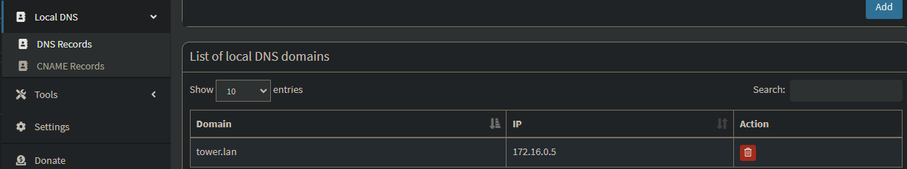
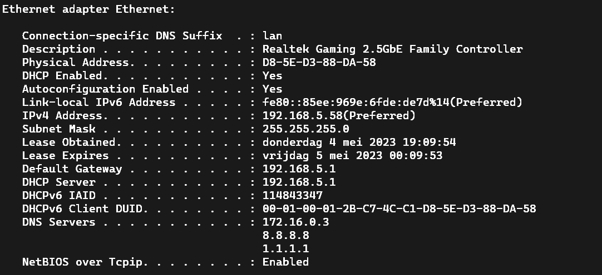
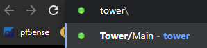
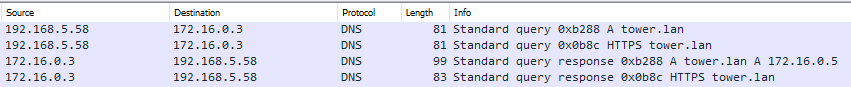
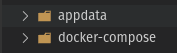
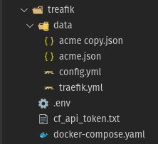
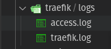

# Local DNS

## Wat is local DNS?

Local DNS is een systeem dat een domeinnaam zoals example.com vertaalt naar het numerieke IP-adres van de server waar de inhoud zich bevindt. Wanneer je een netwerkverzoek doet met een domeinnaam, zal je systeem een DNS-zoekopdracht uitvoeren om het serveradres te bepalen waarmee het contact moet opnemen. Dit voegt een extra vertraging toe aan elk verzoek dat je doet.

Je kunt je eigen DNS-server draaien om meer controle te hebben over je netwerk. Een veelvoorkomende reden is dat je netwerk-niveau domeinmappings kunt configureren, zoals web-server naar `192.168.0.101`. Door je router zo in te stellen dat hij je DNS gebruikt, kun je met elk van je verbonden apparaten toegang krijgen tot `192.168.0.101` via `http://web-server.example.com`

## Hoe Local DNS opzetten

Dit is heel simpel op te zetten door middel van volgende tools:

- [PiHole](pihole.md)
- [PfSense](../router/pfsense.md)
- [Unifi](../router/unifi.md)
- [Windows server](../../windows/windows_server.md)
- andere dns software

### Praktische voorbeelden

`tower.lan` -> `172.16.0.5`

`router1.lan` -> `192.168.1.11`

## PiHole

Hier heb ik een voorbeeld van hoe je dit configureerd in PiHole.


## Suffix

### Wat is een DNS Suffix?

Een DNS-Suffix is het eerste deel van een domeinnaam, zoals `example.com`. Het wordt gebruikt om een domein te identificeren en te onderscheiden van andere domeinen.

Geef in een command prompt volgende in:

```bash
ipconfig /all
```


> Je zult zien dat bij iedere netwerkadapter (wifi, eth, vpn,...) er `Connection-specific DNS Suffix` zal staan.

In dit voorbeeld staat hier `lan`. Dat wil zeggen dat ik dus met mijn browser kan navigeren naar `tower\`, die uitkomt op mijn server, genaamd `tower`.
Je moet je geen zorgen maken over de poorten, want elke service zal automatisch volgende poorten aanspreken:

- RDP: `3389`
- ssh: `22`
- http: `80`
- minecraft: `25565`

!!! note
    Local DNS houd geen rekening met custom poorten voor een service.
    Dit kan je wel op andere manieren oplossen.(comming soon).

Je kan meer dan 1 suffix statisch instellen of meegeven met je DHCP release.
Als je dit in [Wireshark](../tools/wireshark.md) zou capturen zal je zien dat hij achter `tower` alle suffixen gaat plakken en dat over het netwerk naar de local dns server zal sturen. Dit kan je capturen volgens [deze](../tools/wireshark.md#local-dns-prefix-capturen) methode:






## Local DNS met custom poorten

### Treafik

In onze case gebruiken we treafik.
Het gemakkelijk aan dit is dat je zowel lokaal als extern met dezelfde url aan je services kunt.
Dit hangt uitraard van je instellingen af.

!!! note
    Zolang je in cloudflare geen DNS record aanmaakt werkt de DNS enkel lokaal.

Het volgende voorbeeld is in docker.

!!! note
    Graag voldens volgende structuur maken. Als je dit anders wilt pas je dit aan in de docker-compose.yaml






#### docker-compose.yaml

```bash
version: "3.8"

services:
  traefik:
    image: traefik:v3.0
    container_name: traefik
    restart: unless-stopped
    security_opt:
      - no-new-privileges:true
    networks:
      - proxy
    ports:
      - 80:80
      - 443:443/tcp
      # - 443:443/udp # Uncomment if you want HTTP3
    environment:
      CF_DNS_API_TOKEN_FILE: /run/secrets/cf_api_token # note using _FILE for docker secrets
      # CF_DNS_API_TOKEN: ${CF_DNS_API_TOKEN} # if using .env
      TRAEFIK_DASHBOARD_CREDENTIALS: ${TRAEFIK_DASHBOARD_CREDENTIALS}
    secrets:
      - cf_api_token
    env_file: .env # use .env
    volumes:
      - /etc/localtime:/etc/localtime:ro
      - /var/run/docker.sock:/var/run/docker.sock:ro
      - ./data/traefik.yml:/traefik.yml:ro
      - ./data/acme.json:/acme.json
      - ./data/config.yml:/config.yml:ro
      - /home/USER/appdata/traefik/logs:/var/log/traefik
    labels:
      - "traefik.enable=true"
      - "traefik.http.routers.traefik.entrypoints=http"
      - "traefik.http.routers.traefik.rule=Host(`traefik-dashboard.domain.be`)"
      - "traefik.http.middlewares.traefik-auth.basicauth.users=${TRAEFIK_DASHBOARD_CREDENTIALS}"
      - "traefik.http.middlewares.traefik-https-redirect.redirectscheme.scheme=https"
      - "traefik.http.middlewares.sslheader.headers.customrequestheaders.X-Forwarded-Proto=https"
      - "traefik.http.routers.traefik.middlewares=traefik-https-redirect"
      - "traefik.http.routers.traefik-secure.entrypoints=https"
      - "traefik.http.routers.traefik-secure.rule=Host(`traefik-dashboard.domain.be`)"
      - "traefik.http.routers.traefik-secure.middlewares=traefik-auth"
      - "traefik.http.routers.traefik-secure.tls=true"
      - "traefik.http.routers.traefik-secure.tls.certresolver=cloudflare"
      - "traefik.http.routers.traefik-secure.tls.domains[0].main=domain.be" # copy past indien meerdere domeinen maar dan met een 1 (Arrey)
      - "traefik.http.routers.traefik-secure.tls.domains[0].sans=*.domain.be" # copy past indien meerdere domeinen maar dan met een 1 (Arrey)
      - "traefik.http.routers.traefik-secure.service=api@internal"
      #- kuma.__solo_app="Traefik", 1, "Traefik", "Traefik"

secrets:
  cf_api_token:
    file: ./cf_api_token.txt

networks:
  proxy:
    external: true
```

#### cf_api_token.txt

```bash
#api token cloudflare
#Cloudflare --> Right ebove user --> Appearance --> api tokens --> create token
#Chose 1 or more domains
#Plain tekst below
```

#### .env

```bash
# Declaring the user list
#
# Note: when used in docker-compose.yml all dollar signs in the hash need to be doubled for escaping.
# To create a user:password pair, the following command can be used:
# echo $(htpasswd -nb user password) | sed -e s/\\$/\\$\\$/g
#
# Also note that dollar signs should NOT be doubled when they not evaluated (e.g. Ansible docker_container module).
TRAEFIK_DASHBOARD_CREDENTIALS=admin:$$2y$$05$$8eA6bz6E7J/ChsRFuD8njeW45yfJutYYb4HxwgUir3HP4EsggP/QNo0.
```

#### traefik.yml

```bash
api:
  dashboard: true
  debug: true

entryPoints:
  http:
    address: ":80"
    forwardedHeaders:
      trustedIPs: &trustedIps
        # Start of Clouflare public IP list for HTTP requests, remove this if you don't use it
        - 173.245.48.0/20
        - 103.21.244.0/22
        - 103.22.200.0/22
        - 103.31.4.0/22
        - 141.101.64.0/18
        - 108.162.192.0/18
        - 190.93.240.0/20
        - 188.114.96.0/20
        - 197.234.240.0/22
        - 198.41.128.0/17
        - 162.158.0.0/15
        - 104.16.0.0/13
        - 104.24.0.0/14
        - 172.64.0.0/13
        - 131.0.72.0/22
        - 2400:cb00::/32
        - 2606:4700::/32
        - 2803:f800::/32
        - 2405:b500::/32
        - 2405:8100::/32
        - 2a06:98c0::/29
        - 2c0f:f248::/32
        # End of Cloudlare public IP list
    http:

      redirections:
        entryPoint:
          to: https
          scheme: https
  https:
    address: ":443"

serversTransport:
  insecureSkipVerify: true

providers:
  docker:
    endpoint: "unix:///var/run/docker.sock"
    exposedByDefault: false
  file:
    filename: /config.yml
    watch: true

certificatesResolvers:
  cloudflare:
    acme:
      email: user@domain.be
      storage: acme.json
      caServer: https://acme-v02.api.letsencrypt.org/directory # prod (default)
      # caServer: https://acme-staging-v02.api.letsencrypt.org/directory # staging
      dnsChallenge:
        provider: cloudflare
        #disablePropagationCheck: true # uncomment this if you have issues pulling certificates through cloudflare, By setting this flag to true disables the need to wait for the propagation of the TXT record to all authoritative name servers.
        #delayBeforeCheck: 60s # uncomment along with disablePropagationCheck if needed to ensure the TXT record is ready before verification is attempted
        resolvers:
          - "1.1.1.1:53"
          - "1.0.0.1:53"

log:
  level: "INFO"
  filePath: "/var/log/traefik/traefik.log"
accessLog:
  filePath: "/var/log/traefik/access.log"
  ```

#### config.yaml

```bash
http:
 #region routers
  routers:
    sub:
      entryPoints:
        - "https"
      rule: "Host(`sub.domain.be`)"
      middlewares:
        - default-headers
        - https-redirectscheme
      tls: {}
      service: sub


#endregion
#region services
  services:
    sub:
      loadBalancer:
        servers:
          - url: "http://172.30.0.50:5042"
        passHostHeader: true


#endregion
  middlewares:
    https-redirectscheme:
      redirectScheme:
        scheme: https
        permanent: true

    default-headers:
      headers:
        frameDeny: true
        browserXssFilter: true
        contentTypeNosniff: true
        forceSTSHeader: true
        stsIncludeSubdomains: true
        stsPreload: true
        stsSeconds: 15552000
        customFrameOptionsValue: SAMEORIGIN
        customRequestHeaders:
          X-Forwarded-Proto: https

    default-whitelist:
      ipWhiteList:
        sourceRange:
        - "10.0.0.0/8"
        - "192.168.0.0/16"
        - "172.16.0.0/12"

    secured:
      chain:
        middlewares:
        - default-whitelist
        - default-headers
```

#### acme.json

Deze file laat je leeg deze word zelf aangevult.

```bash

```
