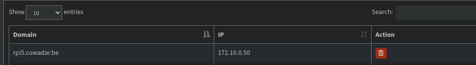
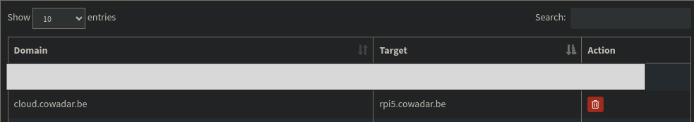

# Local DNS

## Wat is local DNS?

Local DNS is een systeem dat een domeinnaam zoals example.com vertaalt naar het numerieke IP-adres van de server waar de inhoud zich bevindt. Wanneer je een netwerkverzoek doet met een domeinnaam, zal je systeem een DNS-zoekopdracht uitvoeren om het serveradres te bepalen waarmee het contact moet opnemen. Dit voegt een extra vertraging toe aan elk verzoek dat je doet.

Je kunt je eigen DNS-server draaien om meer controle te hebben over je netwerk. Een veelvoorkomende reden is dat je netwerk-niveau domeinmappings kunt configureren, zoals web-server naar `192.168.0.101`. Door je router zo in te stellen dat hij je DNS gebruikt, kun je met elk van je verbonden apparaten toegang krijgen tot `192.168.0.101` via `http://web-server.example.com`

## Hoe Local DNS opzetten

Dit is heel simpel op te zetten door middel van volgende tools:

- [PiHole](pihole.md)
- [PfSense](../router/pfsense.md)
- [Unifi](../router/unifi.md)
- [Windows server](../../windows/windows_server.md)
- andere dns software

### Praktische voorbeelden

`tower.lan` -> `172.16.0.5`

`router1.lan` -> `192.168.1.11`

## PiHole

Hier heb ik een voorbeeld van hoe je dit configureerd in PiHole.

## Suffix

### Wat is een DNS Suffix?

Een DNS-Suffix is het eerste deel van een domeinnaam, zoals `example.com`. Het wordt gebruikt om een domein te identificeren en te onderscheiden van andere domeinen.

Geef in een command prompt volgende in:

```bash
ipconfig /all
```


> Je zult zien dat bij iedere netwerkadapter (wifi, eth, vpn,...) er `Connection-specific DNS Suffix` zal staan.

In dit voorbeeld staat hier `lan`. Dat wil zeggen dat ik dus met mijn browser kan navigeren naar `tower\`, die uitkomt op mijn server, genaamd `tower`.
Je moet je geen zorgen maken over de poorten, want elke service zal automatisch volgende poorten aanspreken:

- RDP: `3389`
- ssh: `22`
- http: `80`
- minecraft: `25565`

!!! note
    Bovenstaande stapppen houden geen rekening met custom poorten voor een service.
    Dit kan je wel op andere manieren oplossen.(comming soon).

Je kan meer dan 1 suffix statisch instellen of meegeven met je DHCP release.
Als je dit in [Wireshark](../tools/wireshark.md) zou capturen zal je zien dat hij achter `tower` alle suffixen gaat plakken en dat over het netwerk naar de local dns server zal sturen. Dit kan je capturen volgens [deze](../tools/wireshark.md#local-dns-prefix-capturen) methode:


## Local DNS met custom poorten
In ons voorbeeld gebruiken we [Traefik](traefik.md). Als je de configuratie van deze pagina gedaan hebt is het maar een kleine uitbreiding.

### configuratie Pihole
Wij gebruiken Pihole maar dit kan met elke DNS software.

Er zijn 2 manieren maar die komen op het zelfde neer. Ofwel gebruik je jouw real domain. ofwel gebruik je .local, .lan, etc.
Deze kan je ook vermelden in de Labels.

In pihole ga je naar Local DNS --> DNS/CNAME Record.
Bij A record vul je een url in die verwijst naar je traefik met het IP van traefik uiteraard.
Bij CNAME vul je in wat je wilt intyppen als url die doorverwijst naar de URL van traefik.




!!! tip
    Wat er exact gebeurd is wanneer jij in je browser cloud.cowadar.be zou intyppen dan word eerst het verkeer naar Pihole gestuurd.
    Pihole zegt aah ik heb een CNAME met de naam "cloud.cowadar.be" die vervolgens ziet dat dit word dooverwezen naar "rpi5.cowdar.be".
    deze gaat dan op zijn beurt "rpi5.cowadat.be" resolven en ziet in zijn eigen database dat dit verwijst naar 172.16.0.50.
    Het verkeer word nu naar jouw traefik gestuurd. Nu is het aan Treafik om met het verkeer om te gaan.
    !!! warning
        als je met je real domain heb gewerkt zal de URL waarsschijnlijk bestaan. Is de url niet aanwezig zal je deze handmatig moeten toevoegen in de config file van [Traefik](traefik.md). Of mee in de labels zetten.