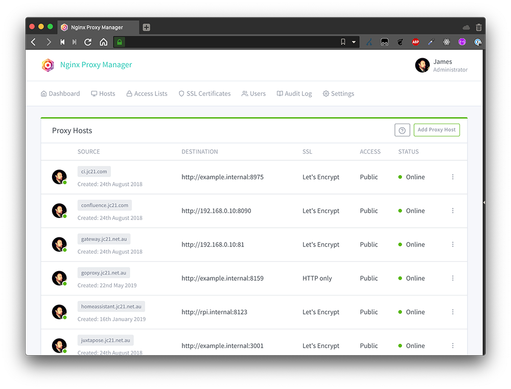

# Nginx Proxy Manager (NPM)

Nginx Proxy Manager is een applicatie die je kunt gebruiken om eenvoudig en veilig je webdiensten op je netwerk bloot te stellen. Het maakt gebruik van Nginx als een reverse proxy om verkeer te routeren naar je interne webserver. Het biedt ook gratis SSL-certificaten met Let's Encrypt en een mooie webinterface om je virtuele hosts te beheren.

Om Nginx Proxy Manager te installeren, heb je [Docker](../../container/docker/docker.md) en [Docker Compose](../../container/docker/docker-compose.md) nodig. Je kunt een [YAML](../../programming/yaml.md)-bestand maken met de configuratie voor de Nginx Proxy Manager container en deze uitvoeren met docker-compose. Daarna kun je inloggen op de admin panel op poort `81` en je webdiensten toevoegen als proxy hosts.

## Vergelijking met Traefik

| Kenmerk | Traefik | Nginx Proxy Manager |
| --- | --- | --- |
| Webinterface | Ja, maar alleen voor monitoring en statistieken | Ja, voor het beheren en configureren van proxy hosts, SSL-certificaten en gebruikers |
| Automatische SSL-certificaten met Let's Encrypt | Ja, met DNS-uitdaging of HTTP-uitdaging | Ja, met HTTP-uitdaging |
| Ondersteuning voor meerdere gebruikers | Nee | Ja, met verschillende toegangsniveaus |
| Configuratie via labels | Ja, voor docker containers | Nee |
| Configuratie via bestanden | Ja, met YAML of TOML | Nee |
| Ondersteuning voor OAuth | Ja, met externe providers zoals Google of Github | Nee |
| Dynamische routering | Ja, met service discovery en load balancing | Nee |
| Ondersteuning voor Kubernetes | Ja, met een ingebouwde controller | Nee |
