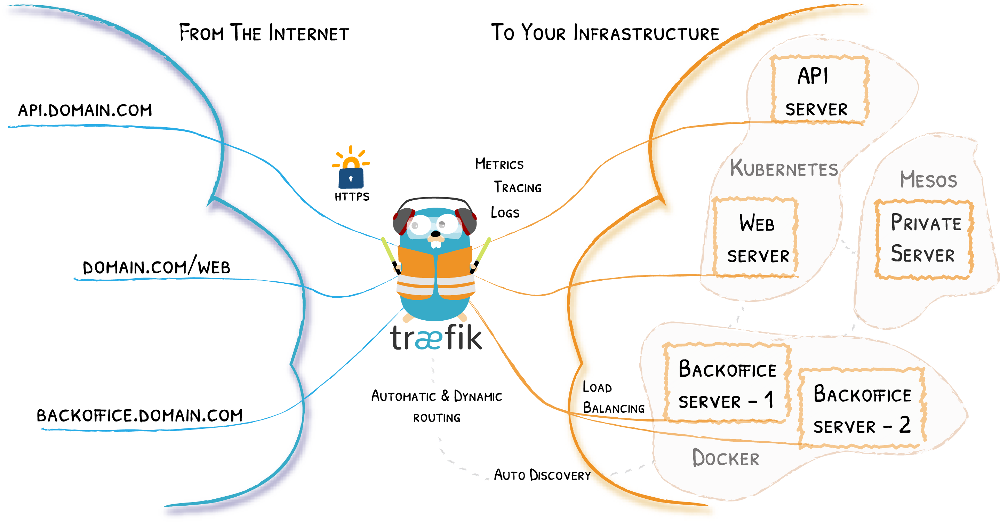
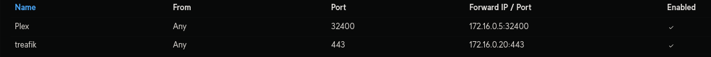
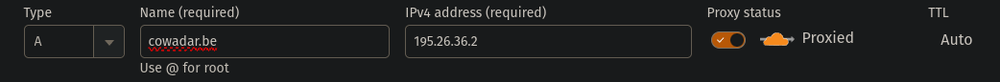
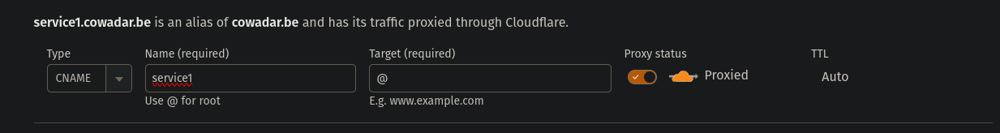
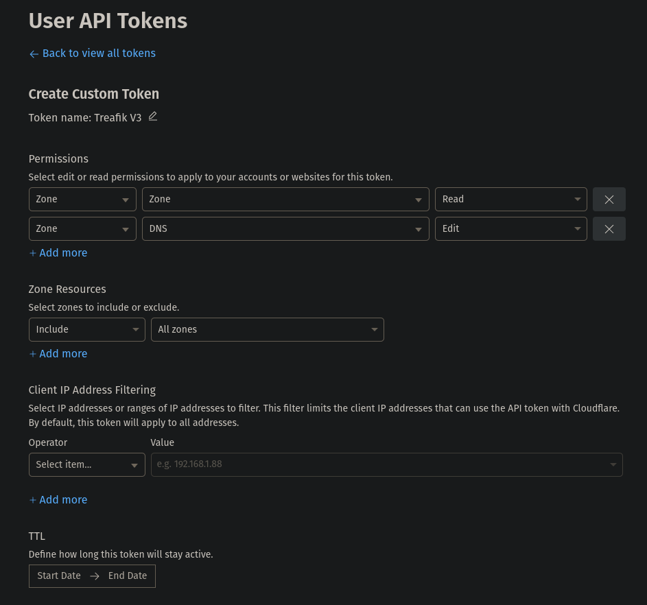

# Treafik

## Certificaten voor meerdere domeinen in Traefik

Zie [https://doc.traefik.io/traefik/routing/routers/#certresolver](https://doc.traefik.io/traefik/routing/routers/#certresolver)


## Treafik



Traefik is een reverse proxy. Dit wil zeggen dat je heel gemakkelijk verschillende services kunt bereiken vanaf het internet zonder elke keer een port open te zetten.
De enigeste poort die je moet openzetten is 443. En verwijzen naar het toest (IP) waar Traefik op draait.

In dit voorbeeld gebruiken we een firewall van het met Unifi. Dit kan je ook perfect in de router(modem) van uw provider doen.


Bij je DNS provider verwijs je een A record door naar je Publiek IP (dit kan ook automatisch gebeuren door [DDNS](ddns.md)).
Voor alle services gebruik je een CNAME record die verwijst naar @ (@ = jouw domein).




### Installatie bestanden
Als je dat eenmaal gedaan hebt kan je beginnen aan de configuratie van Traefik.

!!! info 
    Onze Traefik gebruikt een dynamische file. Dat wilt zeggen dat je als je de configuratie aanpast dat je niet elke keer de docker opnieuw moet genereren.

!!! info
    Graag volgens volgende map structuur maken.

    ```bash
    docker
      ├── appdata
      │     ├── acme
      │     │   └── acme.json
      │     ├── logs
      │     │   ├── access.log
      │     │   └── traefik.log
      │     └── rules
      │         ├── app-ha.yml
      │         ├── chain-basic-auth.yml
      │         ├── chain-no-auth.yml
      │         ├── middlewares-basic-auth.yml
      │         ├── middlewares-buffering.yml
      │         ├── middlewares-crowdsec.yml
      │         ├── middlewares-headers.yml
      │         ├── middlewares-rate-limit.yml
      │         ├── middlewares-secure-headers.yml
      │         ├── middlewares-websocket.yml
      │         └── tls-opts.yml
      └──docker-compose
            ├── secrets
            │   ├── basic_auth_credentials
            │   └── cf_dns_api_token

            ├── compose.yml
            └──env
    ```

??? "Configuratie bestanden"
    !!! warning
        Vergeet niet alle gegevens naar die van jou te veranderen!!
    === "docker-compose.yaml"

        ```yaml
        services:
          # Traefik 3 - Reverse Proxy
          traefik:
            container_name: traefik
            image: traefik:latest
            security_opt:
              - no-new-privileges:true
            restart: unless-stopped
            # depends_on:
            #   - socket-proxy
            networks:
              #- swarm-traefik
            command: # CLI arguments
              - --global.checkNewVersion=true
              - --global.sendAnonymousUsage=false
              - --entrypoints.web-external.address=:80
              - --entrypoints.web-internal.address=:81
              - --entrypoints.websecure-external.address=:444
              - --entrypoints.websecure-internal.address=:443
              # - --entrypoints.traefik.address=:8080
              - --entrypoints.web-external.http.redirections.entrypoint.to=websecure-external
              - --entrypoints.web-external.http.redirections.entrypoint.scheme=https
              - --entrypoints.web-external.http.redirections.entrypoint.permanent=true
              - --entrypoints.web-internal.http.redirections.entrypoint.to=websecure-internal
              - --entrypoints.web-internal.http.redirections.entrypoint.scheme=https
              - --entrypoints.web-internal.http.redirections.entrypoint.permanent=true
              - --api=true
              - --api.dashboard=true
              # - --api.insecure=true
              # - --serversTransport.insecureSkipVerify=true
              # Allow these IPs to set the X-Forwarded-* headers - Cloudflare IPs: https://www.cloudflare.com/ips/
              - --entrypoints.websecure-external.forwardedHeaders.trustedIPs=$CLOUDFLARE_IPS,$LOCAL_IPS
              - --entrypoints.websecure-internal.forwardedHeaders.trustedIPs=$CLOUDFLARE_IPS,$LOCAL_IPS
              - --log=true
              - --log.filePath=/logs/traefik.log
              - --log.level=INFO # (Default: error) DEBUG, INFO, WARN, ERROR, FATAL, PANIC
              - --accessLog=true
              - --accessLog.filePath=/logs/access.log
              - --accessLog.bufferingSize=100 # Configuring a buffer of 100 lines
              - --accessLog.filters.statusCodes=204-299,400-499,500-599
              - --providers.docker=true
              # --providers.docker.endpoint=unix:///var/run/docker.sock # Disable for Socket Proxy. Enable otherwise.
              - --providers.docker.endpoint=tcp://socket-proxy:2375 # Enable for Socket Proxy. Disable otherwise.
              - --providers.docker.exposedByDefault=false
              - --providers.docker.network=t3_proxy
              # - --providers.docker.swarmMode=true # Traefik v2 Swarm
              # - --providers.swarm.endpoint=tcp://127.0.0.1:2377 # Traefik v3 Swarm
              - --entrypoints.websecure-external.http.tls=true
              - --entrypoints.websecure-external.http.tls.options=tls-opts@file
              - --entrypoints.websecure-internal.http.tls=true
              - --entrypoints.websecure-internal.http.tls.options=tls-opts@file
              # Add dns-cloudflare as default certresolver for all services. Also enables TLS and no need to specify on individual services
              - --entrypoints.websecure-external.http.tls.certresolver=dns-cloudflare
              - --entrypoints.websecure-external.http.tls.domains[0].main=$DOMAINNAME_1
              - --entrypoints.websecure-external.http.tls.domains[0].sans=*.$DOMAINNAME_1
              - --entrypoints.websecure-internal.http.tls.certresolver=dns-cloudflare
              - --entrypoints.websecure-internal.http.tls.domains[1].main=$DOMAINNAME_2
              - --entrypoints.websecure-internal.http.tls.domains[1].sans=*.$DOMAINNAME_2
              # - DOMAINS-PLACEHOLDER-DO-NOT-DELETE
              - --providers.file.directory=/rules # Load dynamic configuration from one or more .toml or .yml files in a directory
              - --providers.file.watch=true # Only works on top level files in the rules folder
              # - --certificatesResolvers.dns-cloudflare.acme.caServer=https://acme-staging-v02.api.letsencrypt.org/directory # LetsEncrypt Staging Server - uncomment when testing
              - --certificatesResolvers.dns-cloudflare.acme.storage=/acme.json
              - --certificatesResolvers.dns-cloudflare.acme.dnsChallenge.provider=cloudflare
              - --certificatesResolvers.dns-cloudflare.acme.dnsChallenge.resolvers=1.1.1.1:53,1.0.0.1:53
              - --certificatesResolvers.dns-cloudflare.acme.dnsChallenge.delayBeforeCheck=120 # To delay DNS check and reduce LE hitrate
              #- --certificatesResolvers.dns-cloudflare.acme.dnsChallenge.disablePropagationCheck=true
              # - METRICS-PLACEHOLDER-DO-NOT-DELETE
            ports:
              - "80:80"
              - "81:81"
              - "443:443"
              - "444:444"
              # - "8080:8080"
            volumes:
              - $APPDATADIR/traefik/rules:/rules
              # - /var/run/docker.sock:/var/run/docker.sock:ro # Use Docker Socket Proxy instead for improved security
              - $APPDATADIR/traefik/acme/acme.json:/acme.json
              - $LOGDIR/traefik:/logs
            environment:
              - TZ=$TZ
              - CF_DNS_API_TOKEN_FILE=/run/secrets/cf_dns_api_token
              - HTPASSWD_FILE=/run/secrets/basic_auth_credentials # HTTP Basic Auth Credentials
              - DOMAINNAME_1 # Passing the domain name to traefik container to be able to use the variable in rules.
              - DOMAINNAME_2
              # - TRAEFIK_AUTH_BYPASS_KEY
            secrets:
              - cf_dns_api_token
              - basic_auth_credentials
            labels:
              - "traefik.enable=true"
              # HTTP Routers
              - "traefik.http.routers.traefik-rtr.entrypoints=websecure-internal,websecure-external"
              - "traefik.http.routers.traefik-rtr.rule=Host(`traefik-dashboard.$DOMAINNAME_1`)"
              # Services - API
              - "traefik.http.routers.traefik-rtr.service=api@internal"
              # Middlewares
              - "traefik.http.routers.traefik-rtr.middlewares=chain-basic-auth@file" # For Basic HTTP Authentication

          # Traefik Error Log (traefik.log) for Dozzle
          traefik-error-log:
            container_name: traefik-error-log
            image: alpine
            volumes:
              - $LOGDIR/traefik/traefik.log:/var/log/stream.log
            command:
              - tail
              - -f
              - /var/log/stream.log
            network_mode: none
            restart: unless-stopped

          # Traefik Access Log (access.log) for Dozzle
          traefik-access-log:
            container_name: traefik-access-log
            image: alpine
            volumes:
              - $LOGDIR/traefik/access.log:/var/log/stream.log
            command:
              - tail
              - -f
              - /var/log/stream.log
            network_mode: none
            restart: unless-stopped

          # Traefik Certs Dumper - Extract LetsEncrypt Certificates - Traefik2 Compatible
          traefik-certs-dumper:
            container_name: traefik-certs-dumper
            image: humenius/traefik-certs-dumper:latest
            security_opt:
              - no-new-privileges:true
            restart: unless-stopped
            network_mode: none
            # command: --restart-containers container1,container2,container3
            volumes:
              - $APPDATADIR/traefik/acme:/traefik:ro
              - $APPDATADIR/traefik-certs/$DOMAINNAME_1:/output:rw
              # - /var/run/docker.sock:/var/run/docker.sock:ro # Only needed if restarting containers (use Docker Socket Proxy instead)
            environment:
              DOMAIN: $DOMAINNAME_1


          cloudflare-companion:
            image: tiredofit/traefik-cloudflare-companion
            container_name: cloudflare-companion
            volumes:
              - $LOGDIR:/logs
              # - /var/run/docker.sock:/var/run/docker.sock
            secrets:
            - cf_dns_api_token
            environment:
              - TIMEZONE=$TZ
              - LOG_TYPE=BOTH
              - LOG_LEVEL=INFO
              - TRAEFIK_VERSION=2
              - CF_EMAIL=$CF_EMAIL
              - CF_TOKEN=$CF_GLOBAL_TOKEN
              - RC_TYPE=CNAME
              - DOMAIN1_PROXIED=TRUE
              - TARGET_DOMAIN=$DOMAINNAME_1
              - DOMAIN1=$DOMAINNAME_1
              - DOMAIN1_ZONE_ID=$DOMAIN1_ZONE_ID
              - DOCKER_HOST=tcp://socket-proxy:2375 
              - REFRESH_ENTRIES=TRUE
              #- DOCKER_CERT_PATH=/docker-certs
              #- DOCKER_TLS_VERIFY=1

              - TRAEFIK_FILTER_LABEL=traefik.constraint
              - TRAEFIK_FILTER=proxy-public
            # depends_on:
            #   - socket-proxy
            networks:
              - socket_proxy
            restart: always
            # labels:
              # Add hosts specified in rules here to force cf-companion to create the CNAMEs
              # Since cf-companion creates CNAMEs based on host rules, this a workaround for non-docker/external apps
              # - "traefik.http.routers.cf-companion-rtr.rule=HostHeader(`vault.$DOMAINNAME_1`) || HostHeader(`ha.$DOMAINNAME_1`) || HostHeader(`overseerr.$DOMAINNAME_1`) || HostHeader(`nas.$DOMAINNAME_1`) || HostHeader(`todo.$DOMAINNAME_1`) || HostHeader(`auth.$DOMAINNAME_1`)"
              # - traefik.http.routers.example.rule=Host(`ha.$DOMAINNAME_1`) || Host(`overseerr.$DOMAINNAME_1`)

        networks:
          swarm-traefik:
            external: true
        secrets:
          authelia_session_secret:
            file: $SECRETDIR/authelia_session_secret
          authelia_storage_encryption_key:
            file: $SECRETDIR/authelia_storage_encryption_key

        ```

    === "cf_dns_api_token"

        ```yaml
           #api token cloudflare
           #Cloudflare --> Right ebove user --> Appearance --> api tokens --> create token
           #Chose 1 or more domains
           #Plain tekst below
        ```
        
    === ".env"

        ``` yaml
        ###### Coudflare
        CF_EMAIL=<clouflaremail>
        DOMAIN1_ZONE_ID=<zoneid>
        CF_GLOBAL_TOKEN=<global token>
        ```
    === "basic_auth_credentials"

        # Declaring the user list
        #
        # Note: when used in docker-compose.yml all dollar signs in the hash need to be doubled for escaping.
        # To create a user:password pair, the following command can be used:
        # echo $(htpasswd -nb user password) | sed -e s/\\$/\\$\\$/g
        #
        # Also note that dollar signs should NOT be doubled when they not evaluated (e.g. Ansible docker_container module).
        TRAEFIK_DASHBOARD_CREDENTIALS=admin:$$2y$$05$$8eA6bz6E7J/ChsRFuD8njeW45yfJutYYb4HxwgUir3HP4EsggP/QNo0.

        ```   

    === "acme.json"
          
        !!! warning
            Deze file laat je leeg deze word zelf aangevult.

    === "app-name.yml
        !!! waring
        Pas de Gegevens aan!!!
          
        ``` yaml
        http:
        routers:
          <APP>-rtr:
            rule: "Host(`<APP>.{{env "DOMAINNAME_1"}}`)"
            entryPoints:
              - websecure-external
              - websecure-internal
            middlewares:
              - chain-no-auth
            service: <APP>>-svc
            tls:
              certResolver: dns-cloudflare
              options: tls-opts@file
        services:
          <APP>>-svc:
            loadBalancer:
              servers:
                - url: "http://<ip+port>" # http://IP-ADDRESS:PORT
        ```

    === "chain-basic-auth.yml
        ``` yaml
        http:
          middlewares:
            chain-basic-auth:
              chain:
                middlewares:
                  - middlewares-rate-limit
                  - middlewares-secure-headers
                  # - crowdsec-bouncer
                  - middlewares-basic-auth
                  # - middlewares-compress
        ```

    === "chain-no-auth.yml
          
        ``` yaml
        http:
          middlewares:
            chain-basic-auth:
              chain:
                middlewares:
                  - middlewares-rate-limit
                  - middlewares-secure-headers
                  # - crowdsec-bouncer
                  - middlewares-basic-auth
                  # - middlewares-compress
        ```

    === "middlewares-basic-auth.yml
          
        ``` yaml
        http:
          middlewares:
            middlewares-basic-auth:
              basicAuth:
                # users:
                #   - "user:$apsdfswWvC/6.$E3FtsfTntPC0wVJ7IUVtX1"
                usersFile: "/run/secrets/basic_auth_credentials" 
                realm: "Traefik Basic Auth"
        ```

    === "middlewares-buffering.yml
          
        ``` yaml
        http:
          middlewares:
            middlewares-buffering:
              buffering:
                maxResponseBodyBytes: 2000000
                maxRequestBodyBytes: 10485760  
                memRequestBodyBytes: 2097152  
                memResponseBodyBytes: 2097152
                retryExpression: "IsNetworkError() && Attempts() <= 2"
        ```

    === "middlewares-crowedsec.yml
          
        ``` yaml
        http:
          middlewares:
            crowdsec-bouncer:
              forwardauth:
                address: http://crowdsec-traefik-bouncer:8080/api/v1/forwardAuth
                trustForwardHeader: true
        ```

    === "middlewares-headers.yml
          
        ``` yaml
        middlewares:
          default-headers:
            headers:
              browserXssFilter: true
              contentTypeNosniff: true
              forceSTSHeader: true
              stsIncludeSubdomains: true
              stsPreload: true
              stsSeconds: 31536000
              customFrameOptionsValue: "SAMEORIGIN"
        ```

    === "middlewares-rate-limit.yml
          
        ``` yaml
            http:
              middlewares:
                middlewares-rate-limit:
                  rateLimit:
                    average: 100
                    burst: 200
        ```

    === "middlewares-secure-headers.yml
          
        ``` yaml
        http:
          middlewares:
            middlewares-secure-headers:
              headers:
                accessControlAllowMethods:
                  - GET
                  - OPTIONS
                  - PUT
                accessControlMaxAge: 100
                hostsProxyHeaders:
                  - "X-Forwarded-Host"
                stsSeconds: 63072000
                stsIncludeSubdomains: true
                stsPreload: true
                forceSTSHeader: true # This is a good thing but it can be tricky. Enable after everything works.
                customFrameOptionsValue: SAMEORIGIN # https://developer.mozilla.org/en-US/docs/Web/HTTP/Headers/X-Frame-Options
                contentTypeNosniff: true
                browserXssFilter: true
                referrerPolicy: "same-origin"
                permissionsPolicy: "camera=(), microphone=(), geolocation=(), payment=(), usb=()"
                customResponseHeaders:
                  X-Robots-Tag: "none,noindex,nofollow,noarchive,nosnippet,notranslate,noimageindex" # disable search engines from indexing home server
                  server: "" # hide server info from visitors
                customRequestHeaders:
                  X-Forwarded-Proto: https
        ```

    === "middlewares-websocket.yml
          
        ``` yaml
        http:
          middlewares:
            sslheader:
              headers:
                customRequestHeaders:
                  X-Forwarded-Proto: "https"
        ```

    === "tls-opts.yml
          
        ``` yaml
        tls:
          options:
            tls-opts:
              minVersion: VersionTLS12
              cipherSuites:
                - TLS_ECDHE_ECDSA_WITH_AES_128_GCM_SHA256
                - TLS_ECDHE_RSA_WITH_AES_128_GCM_SHA256
                - TLS_ECDHE_ECDSA_WITH_AES_256_GCM_SHA384
                - TLS_ECDHE_RSA_WITH_AES_256_GCM_SHA384
                - TLS_ECDHE_ECDSA_WITH_CHACHA20_POLY1305
                - TLS_ECDHE_RSA_WITH_CHACHA20_POLY1305
                - TLS_AES_128_GCM_SHA256
                - TLS_AES_256_GCM_SHA384
                - TLS_CHACHA20_POLY1305_SHA256
                - TLS_FALLBACK_SCSV # Client is doing version fallback. See RFC 7507
              curvePreferences:
                - CurveP521
                - CurveP384
              sniStrict: true
        ```


### Run
Als je alle bovenstaande stappen gedaan hebt voer je het volgende commado in de terminal in dezelfde map als docker compose.
```bash
docker compose up -d
``` 

!!! warning
    Check de acme.json deze zou ingevuld moeten worden en daar zie je de certificaten.

### Configureer traefik.yaml

Zoals eerder gezegt is deze file dynamisch. copy past de code voor elke (sub)domein.


??? "traefik.yml edit"

    ```yaml
    routers:
                sub:
                entryPoints:
                    - "https"
                rule: "Host(`sub.domain.be`)"
                middlewares:                      # Desable This if you having troubles 
                    - default-headers               # Learn more about Middlewares
                    - https-redirectscheme          #
                tls: {}
                service: sub

                sub2:
                entryPoints:
                    - "https"
                rule: "Host(`sub2.domain.be`)"
                middlewares:                       
                    - default-headers               
                    - https-redirectscheme          
                tls: {}
                service: sub2


            #endregion
            #region services
            services:
                sub:
                loadBalancer:
                    servers:
                    - url: "http://172.30.0.50:5042"
                    passHostHeader: true

                sub2:
                loadBalancer:
                    servers:
                    - url: "http://172.30.0.51:5042"
                    passHostHeader: true
    ```
### Advanced
U Kunt ook traefik zijn configuratie automatisch laten verlopen door middel van labels op je docker containers te zetten.
De configuratie bij uw DNS provider zal nog steeds handmatig moeten gebeuren.

??? Labels

    ```yaml
        labels:
        # if you are not using traefik, comment out labels
        - "traefik.enable=true"
        - "traefik.http.routers.portainer.entrypoints=http"
        - "traefik.http.routers.portainer.rule=Host(`pihole.domain.be`)"
        - "traefik.http.middlewares.portainer-https-redirect.redirectscheme.scheme=https"
        - "traefik.http.routers.portainer.middlewares=portainer-https-redirect"
        - "traefik.http.routers.portainer-secure.entrypoints=https"
        - "traefik.http.routers.portainer-secure.rule=Host(`pihole.domain.be`)"
        - "traefik.http.routers.portainer-secure.tls=true"
        - "traefik.http.routers.portainer-secure.service=portainer"
        - "traefik.http.services.portainer.loadbalancer.server.port=9000"
        - "traefik.docker.network=proxy"
    ```