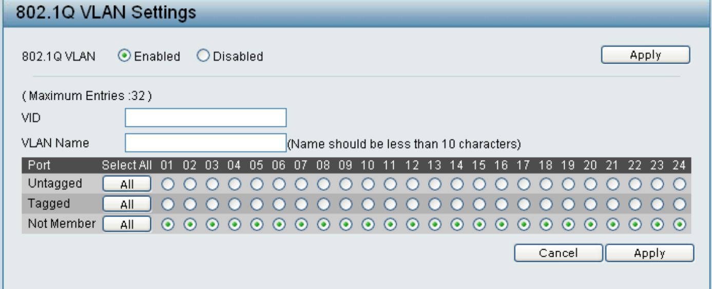
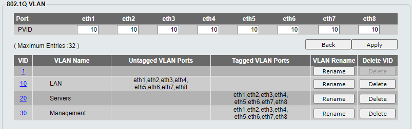

Een D-Link switch is een netwerkapparaat dat wordt geproduceerd door het bedrijf D-Link. Een switch wordt gebruikt om meerdere apparaten in een netwerk met elkaar te verbinden en gegevens tussen deze apparaten te verzenden. D-Link produceert verschillende soorten switches, waaronder unmanaged switches, smart switches en managed switches, die elk verschillende functies en mogelijkheden bieden.

## DGS-1100-08

### Connection

Sluit je toestel aan op de switch. Ga daarna naar je ipv4 instellingen. Stel dan de volgende waardes in.
IP address: 10.90.90.80, Subnet: 255.0.0.0, Default Gateway: 10.90.90.90; DNS: 8.8.8.8,8.8.4.4.

Hierna ga je naar je webbrowser en geef je als URL: 10.90.90.90.
Het standaard wachtwoord is `admin`.

### Configuren

#### Change management IP en VLAN

Meld aan op de switch met bovenstaande stappen. Als dat gelukt is geef je de switch zelf een static ip in de range van je computer.

!!! note
    Als je een met trunks werkt zal dit het ip zijn van je native vlan.

!!! warning
    Dit is mij nog niet gelukt op een vlan ID (Management Vlan).
    Hier op mijn Cisco switch staan mijn native vlan op mijn management. Op de D-link heb ik mijn poorten op access/trunk poorten staan met native mijn computer network.

#### 802.1Q

om meerdere VLANs over deze switch te sturen zal je tegen de switch moeten zetten dat deze bestaat.
Standaard heeft hij Vlan1 (untagged) aangemaakt. In mijn case heb ik VLAN 10 (LAN), VLAN 20 (Servers).
Eerst maak ik de vlans aan en zeg ik aan welke poorten deze gekoppeld moeten worden. Wat hier wel belangrijk is dat je duidelijke meegeeft per poort of dit Untagged, Tagged of Not Member is.

!!! note
    Zie er we wanneer die voor client of een server is. Als dit over client gaat zou ik de poort untagged voor lan nemen. En voor servers zou ik je server VLAN nemen.

