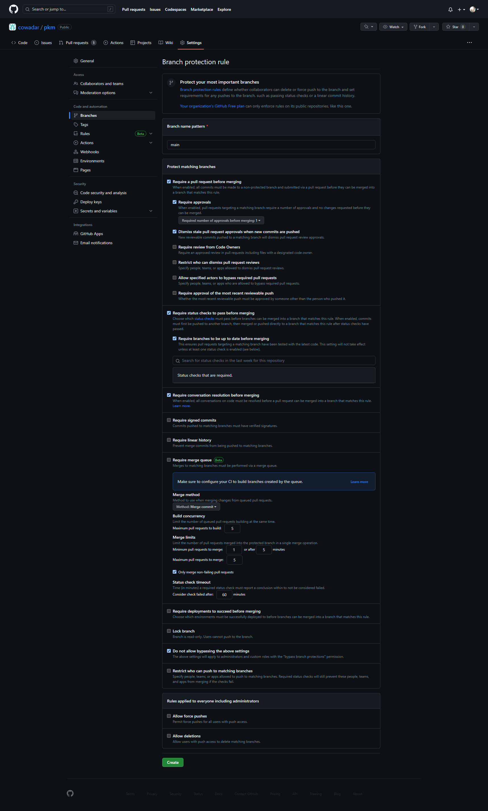

# GitHub Brancheregels (Bescherm je Git-branches) - YouTube

In deze video bespreken we branchebescherming en het belang ervan bij het handhaven van codekwaliteit en samenwerking binnen een repository. De spreker benadrukt de uitdagingen van het beheren van meerdere beoordelingen, CI-controles en andere vereisten handmatig. Ze stellen voor om de brancheregelfunctie van GitHub te gebruiken om deze vereisten geautomatiseerd af te handelen.

## Configuratiestappen

1. Ga naar de **Instellingen** van de repository.
2. Selecteer het tabblad **Branches**.
3. Configureer brancheregels voor een specifieke branch of gebruik wildcards voor meerdere branches.
4. Specificeer de gewenste regels en opties voor branchebescherming:

## Configuring Protection Rules

After selecting the desired branch, a range of options is presented for configuration. The speaker suggests the following practices and encourages viewers to share their preferences in the comments:

1. **Require a pull request before merging** ✅: This option ensures that commits made to unprotected branches, such as feature- or bug-specific branches, go through a pull request process before merging into the main branch. The speaker recommends enabling this option and discusses the importance of having multiple approvals for significant changes.

2. **Require approvals** ✅ (1): Users can specify the minimum number of approvals required for merging a pull request. Depending on the situation, it can be set to one or more, striking a balance between efficiency and thoroughness.

3. **Dismiss Stale Approvals** ✅: This crucial setting automatically dismisses previous approvals when new commits are added to a pull request. By enabling this option, contributors cannot merge additional commits without the newly added code being reviewed.

4. **Check Status of GitHub Actions**: It is advised to ensure that all status checks, including GitHub Actions, pass successfully before merging. Failing checks indicate unresolved issues that need to be fixed before merging.

5. **Keep Branches Up to Date**: The speaker emphasizes the importance of merging changes from the target branch (e.g., main) into the pull request branch before merging. This practice ensures that the changes being merged are compatible with the latest codebase.

6. **Resolve Conversations**: Inline comments and discussions in pull requests are highly encouraged for collaboration and knowledge transfer. It is essential to resolve these conversations by addressing pending issues or marking them as resolved.

7. **Require Signed Commits**: While the speaker acknowledges the benefits of signed commits for verification, they note that it poses a high barrier to entry for contributors. Consequently, enabling this option might not be practical for most projects.

8. **Require Linear History**: The preference for a linear commit history varies among users. The speaker leaves this option open for debate and encourages viewers to share their opinions.

9. **Require Deployments to Succeed**: If branches are deployed to production-like environments, enabling this option ensures that deployments succeed before allowing merges. However, the speaker suggests leaving this option unchecked in most cases, especially when testing can be adequately performed before merging.

10. **Include Administrators**: It is highly recommended to enforce branch protection rules for administrators as well. Although there may be rare occasions where bypassing rules is necessary, it should not become the norm.

11. **Restrict Force Pushes**: Force pushing, which rewrites branch history, should generally be prohibited when collaborating with others. It is crucial to avoid conflicts caused by rewriting history.

12. **Allow Deletions**: Once branches are merged, the speaker suggests deleting feature and bug fix branches to keep the branch list clean. This practice helps maintain a low number of active branches while emphasizing high-quality releases.
