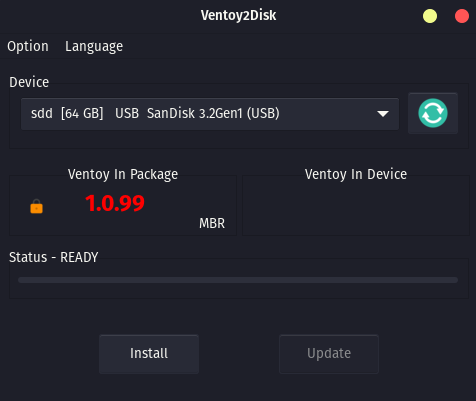
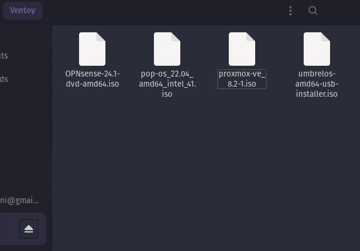

# Ventoy

## Wat is Ventoy?

Ventoy is een open source tool vor het maken van een bootable USB voor ISO/WIM/IMG/VHD(x)/EFI files.
Met ventoy hoeft u de schijf niet steeds opnieuw te formatteren, u hoeft alleen maar de ISO/WIM/IMG/VHD(x)/EFI-bestanden naar de USB-drive te kopiëren en ze direct op te starten.
Je kunt veel bestanden tegelijk kopiëren en ventoy geeft je een opstartmenu waarin je ze kunt selecteren ([screenshot](https://www.ventoy.net/en/index.htmlscreenshot.html)).
U kunt ook door ISO/WIM/IMG/VHD(x)/EFI-bestanden op lokale schijven bladeren en deze opstarten.
x86 Legacy BIOS, IA32 UEFI, x86\_64 UEFI, ARM64 UEFI en MIPS64EL UEFI worden op dezelfde manier ondersteund.
De meeste typen besturingssystemen worden ondersteund (Windows/WinPE/Linux/ChromeOS/Unix/VMware/Xen...)

## Installatie
### Download
download te laatste versie van [https://www.ventoy.net/en/download.html](https://www.ventoy.net/en/download.html)

### Installeren
- Pak het gedownloade bestand uit.
- Open de folder en zoek naar Ventoy2disk/VentoyGUI en open deze file
- Selecteer de USB en druk op install.

- Achter de installatie zie je in je verkenner een USB met de naam Ventoy. Hier drop je alle ISO files in. Deze zijn direkt booteble.

- Restart je computer of steek de USB in de desbetreffende computer en ga naar het bootmenu. Daar zie je de Ventoy USB. Druk vervolgens op de juiste ISO.

## links

**Download**: [https://www.ventoy.net/en/download.html](https://www.ventoy.net/en/download.html)
