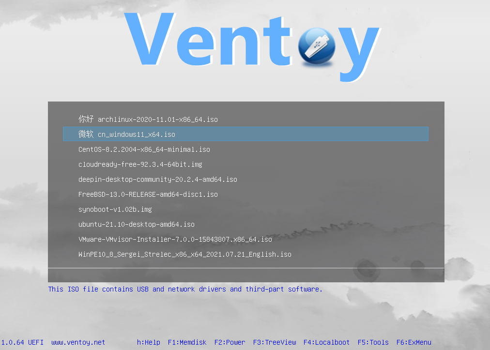

# Ventoy

## Wat is Ventoy?

Ventoy is an open source tool to create bootable USB drive for ISO/WIM/IMG/VHD(x)/EFI files.
With ventoy, you don't need to format the disk over and over, you just need to copy the ISO/WIM/IMG/VHD(x)/EFI files to the USB drive and boot them directly.
You can copy many files at a time and ventoy will give you a boot menu to select them ([screenshot](https://www.ventoy.net/en/index.htmlscreenshot.html)).
You can also browse ISO/WIM/IMG/VHD(x)/EFI files in local disks and boot them.
x86 Legacy BIOS, IA32 UEFI, x86\_64 UEFI, ARM64 UEFI and MIPS64EL UEFI are supported in the same way.
Most types of OS supported (Windows/WinPE/Linux/ChromeOS/Unix/VMware/Xen...)

## links

**Website**: [https://www.ventoy.net/en/index.html](https://www.ventoy.net/en/index.html)
**Download**: [https://www.ventoy.net/en/download.html](https://www.ventoy.net/en/download.html)
