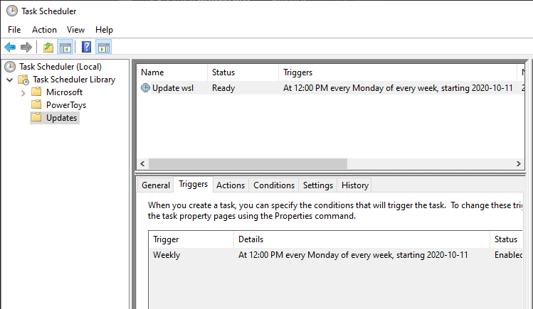

## Automatically update WSL distributions using the Windows Scheduler

Windows Subsystem for Linux (WSL) allows running one or multiple Linux distributions on Windows. Like any Operating System, you must install security updates on it. Instead of doing it manually, let's automate it using the Windows Scheduler!

Open PowerShell and run the following commands to create a scheduled task that updates the default WSL distribution once a week.

```powershell
# https://learn.microsoft.com/en-us/powershell/module/scheduledtasks/new-scheduledtasktrigger?WT.mc_id=DT-MVP-5003978
$Time = New-ScheduledTaskTrigger -At 12:00 -Weekly -WeeksInterval 1 -DaysOfWeek Monday

# https://learn.microsoft.com/en-us/powershell/module/scheduledtasks/new-scheduledtaskaction?WT.mc_id=DT-MVP-5003978
# If you want to update a specific distro, you can add "--distribution <DistributionName>"
$Actions = @(
    New-ScheduledTaskAction -Execute "wsl" -Argument "--user root --exec apt-get update"
    New-ScheduledTaskAction -Execute "wsl" -Argument "--user root --exec apt-get upgrade --yes"
)

# https://learn.microsoft.com/en-us/powershell/module/scheduledtasks/new-scheduledtasksettingsset?WT.mc_id=DT-MVP-5003978
$Settings = New-ScheduledTaskSettingsSet -WakeToRun:$false `
                                         -MultipleInstances IgnoreNew `
                                         -RunOnlyIfNetworkAvailable:$true `
                                         -StartWhenAvailable:$true

# https://learn.microsoft.com/en-us/powershell/module/scheduledtasks/register-scheduledtask?WT.mc_id=DT-MVP-5003978
Register-ScheduledTask -TaskName "Update wsl" -Trigger $Time -Action $Actions -Settings $Settings -TaskPath Updates
```

!!! note
    If you have multiple WSL distributions, you must duplicate the previous commands for each distro and add `--distribution <ditro_name>`

If everything's good, you should see the new task in the Task Scheduler:



You can run the task manually once to validate it works well. It could take a few minutes if you have never updated the distro!